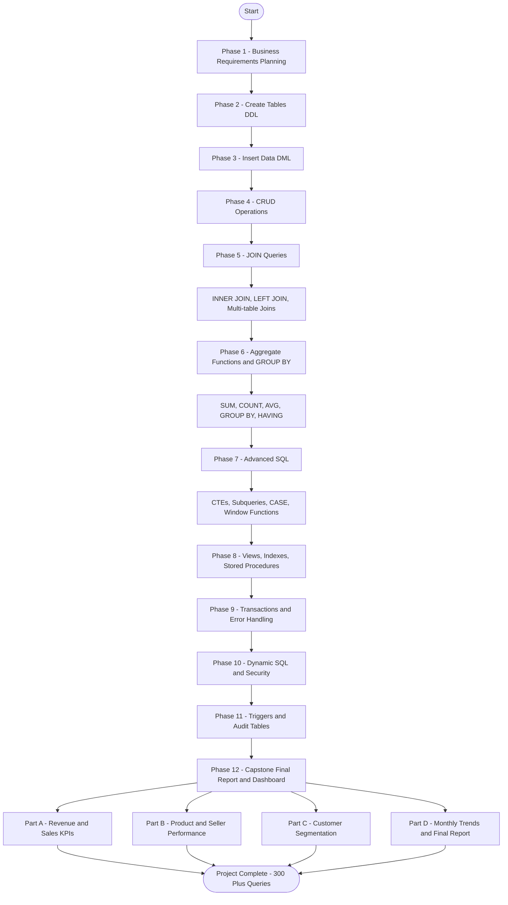

# 🗄️ Olist Store — Sales & Order Management Analytics System

**A Complete End-to-End SQL Capstone Project | Internship: Skillentrix Technologies**

A complete SQL analytics system built on the real-world Brazilian e-commerce dataset from Olist — a marketplace that connects small businesses to customers across Brazil, similar to Amazon Marketplace. The goal is to write 300+ SQL queries across 12 structured phases — from database design all the way to a full executive business dashboard.

---

## 📌 Project

This project builds a complete SQL analytics system on real e-commerce data to answer one central business question:

> **Which sellers, products, and regions are driving revenue — and where is the business losing money?**

We design a normalized 6-table relational database from scratch, load real Olist transactional data, write 300+ queries across 12 structured phases, and deliver a final business dashboard covering KPIs, customer segmentation, seller rankings, and monthly revenue trends.

---

## 🚀 Features

- Designed and created a normalized 6-table relational database from scratch using DDL
- Loaded real Olist e-commerce transactional data across all 6 tables using DML
- Wrote 300+ SQL queries across 12 structured phases from basic to advanced
- Built reusable VIEWs, Stored Procedures, and Indexes for performance and reporting
- Implemented Triggers and Audit Tables for automated data change tracking
- Applied Role-Based Security and Dynamic SQL for controlled data access
- Delivered a 4-part Final Business Dashboard: Revenue KPIs, Product & Seller Performance, Customer Segmentation, and Monthly Trends

---

## 🛠️ Technologies Used

| Tool | Purpose |
|------|---------|
| SQL Server Express | Relational database engine for all queries and storage |
| SSMS (SQL Server Management Studio) | Writing, executing, and managing T-SQL scripts |
| T-SQL | Main query language — CTEs, Window Functions, Triggers, Dynamic SQL |
| Real Olist Dataset | Brazilian e-commerce data covering orders, customers, sellers, products, and payments |

---

## 🔄 Workflow Flowchart


---

## 📂 Project Structure

```
Skillentrix_Intern/
│
├── 📁 Phase_01_Business_Requirements/
│   └── 📄 01_business_requirements.md
│
├── 📁 Phase_02_Create_Tables/
│   └── 📄 02_create_tables.sql
│
├── 📁 Phase_03_Insert_Data/
│   └── 📄 03_insert_data.sql
│
├── 📁 Phase_04_CRUD_Operations/
│   └── 📄 04_crud_operations.sql
│
├── 📁 Phase_05_JOIN_Queries/
│   └── 📄 05_join_queries.sql
│
├── 📁 Phase_06_Aggregate_Functions/
│   └── 📄 06_aggregate_functions.sql
│
├── 📁 Phase_07_Advanced_SQL/
│   └── 📄 07_advanced_sql.sql
│
├── 📁 Phase_08_Views_Indexes_Procedures/
│   └── 📄 08_views_indexes_procedures.sql
│
├── 📁 Phase_09_Transactions_Error_Handling/
│   └── 📄 09_transactions_error_handling.sql
│
├── 📁 Phase_10_Dynamic_SQL_Security/
│   └── 📄 10_dynamic_sql_security.sql
│
├── 📁 Phase_11_Triggers_Audit/
│   └── 📄 11_triggers_audit.sql
│
├── 📁 Phase_12_Capstone_Dashboard/
│   ├── 📄 12a_revenue_kpis.sql
│   ├── 📄 12b_product_seller_performance.sql
│   ├── 📄 12c_customer_segmentation.sql
│   └── 📄 12d_monthly_trends_final_report.sql
│
└── 📄 README.md
```

---

## 🗄️ Database Schema

| Table | Key Columns |
|-------|------------|
| olist_customers_dataset | customer_id (PK), customer_unique_id, customer_city, customer_state |
| olist_orders_dataset | order_id (PK), customer_id (FK), order_status, order_purchase_timestamp, order_delivered_customer_date |
| olist_order_items_dataset | order_id (FK), order_item_id, product_id (FK), seller_id (FK), price, freight_value |
| olist_order_payments_dataset | order_id (FK), payment_sequential, payment_type, payment_installments, payment_value |
| olist_products_dataset | product_id (PK), product_category_name, product_weight_g |
| olist_sellers_dataset | seller_id (PK), seller_city, seller_state |

**Relationships:**
- Customers → Orders (one to many)
- Orders → Order Items (one to many)
- Orders → Payments (one to many)
- Products → Order Items (one to many)
- Sellers → Order Items (one to many)

---

## 📋 Project Phases

| # | Phase | Topic | Queries |
|---|-------|-------|:-------:|
| 1 | Business Requirements | Planning — customers, orders, revenue, products | — |
| 2 | Create Tables (DDL) | 6 tables with PRIMARY KEY, FOREIGN KEY, constraints | — |
| 3 | Insert Data (DML) | Loaded real Olist e-commerce dataset | — |
| 4 | CRUD Operations | INSERT, SELECT, UPDATE, DELETE across all 6 tables | — |
| 5 | JOIN Queries | INNER JOIN, LEFT JOIN, multi-table joins | 52 |
| 6 | Aggregate Functions & GROUP BY | SUM, COUNT, AVG, MIN, MAX, GROUP BY, HAVING | 35 |
| 7 | Advanced SQL | CTEs, Subqueries, CASE, Window Functions (RANK, LAG, LEAD) | 57 |
| 8 | Views, Indexes & Stored Procedures | Reusable views, indexed columns, parameterised procedures | 24 |
| 9 | Transactions & Error Handling | BEGIN TRANSACTION, COMMIT, ROLLBACK, TRY-CATCH | 33 |
| 10 | Dynamic SQL & Security | EXEC, sp_executesql, roles, user permissions | 36 |
| 11 | Triggers & Audit Tables | AFTER INSERT / UPDATE / DELETE triggers, audit logging | 30 |
| 12 | Capstone Final Report & Dashboard | KPIs, segmentation, trends, executive summary | 33 |
| | | **Total Queries** | **300+** |

---

## 📚 Learning Outcomes

By completing this project, I learned how to:

- Design a normalized relational database from scratch with real-world business constraints
- Write complex multi-table JOIN queries connecting up to 5 tables in a single query
- Use Window Functions — RANK(), DENSE_RANK(), LAG(), LEAD(), SUM() OVER() — for advanced analytics
- Build reusable database objects — VIEWs, Stored Procedures, and Indexes — for reporting efficiency
- Implement Transactions with TRY-CATCH error handling to protect data integrity across multi-step operations
- Automate business rules and audit every data change using Triggers and Audit Tables
- Apply Dynamic SQL and Role-Based Security to control who can access which data
- Think like a Data Analyst and translate raw transactional data into actionable business KPIs

---

## 🎯 Key Business Insights

This project reveals several important findings from the Olist dataset:

- **Revenue concentration** — A small number of sellers and product categories drive a disproportionate share of total revenue; top 10 sellers account for an outsized portion of business
- **Payment preferences** — Credit card payments dominate transactions, and customers choosing more installments tend to place higher-value orders
- **Delivery performance** — On-time delivery rates vary significantly by seller state, directly impacting customer experience and repeat purchase behaviour
- **Customer segmentation** — The majority of customers are one-time buyers; the repeat customer base is small but generates significantly higher lifetime value
- **Seasonal trends** — Clear monthly and quarterly revenue patterns reveal predictable peak sales periods that sellers can plan around

Data-driven decisions built on this analysis can help Olist and its seller partners optimize product mix, focus resources on high-performing regions, and improve delivery reliability across Brazil.

---

## ▶️ How to Run

1. Install **SQL Server Express** and **SSMS** (SQL Server Management Studio) on your machine
2. Open SSMS and connect to your local SQL Server instance
3. Create a new database by running: `CREATE DATABASE olist_store;`
4. Run the phase files **in order** — always start with Phase 2 (Create Tables), then Phase 3 (Insert Data)
5. Execute each subsequent phase file to progressively build and explore the analytics system
6. Run the Phase 12 files last to generate the complete final business dashboard and executive report

---

## 📁 Dataset

This project uses the **Brazilian E-Commerce Public Dataset by Olist** — a real-world marketplace dataset containing orders, customers, sellers, products, and payments from 2016 to 2018, with over 100,000 records across the full dataset.

🔗 Dataset Source: [Brazilian E-Commerce Public Dataset by Olist — Kaggle](https://www.kaggle.com/datasets/olistbr/brazilian-ecommerce)

---

## 🙏 Acknowledgements

A huge thank you to **Skillentrix Technologies** for providing structured internship guidance, phased learning milestones, and consistent mentorship throughout this capstone project.

This internship transformed my understanding of SQL — from writing basic SELECT queries to building a production-grade database design, analytics pipeline, and full business reporting system across 12 phases and 300+ queries.

---

*Built with ❤️ during the Skillentrix Technologies SQL Internship*
